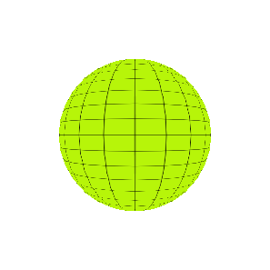

  

  <h1 align="center">Seward Mupereri</h1>
  <h3 align="center">Solo Venture Builder | Founder @ Banya Labs 🌍</h3>

  

    <b>Building 100 African SaaS & AI Products by July 16, 2028.</b> 
    <i>Solving African operational problems with sovereign infrastructure, local-first UX, and agentic AI.</i>
  

  

    
    
    
  

 

  <h2>🚀 About Me & The Mission</h2>
  

    I am a <b>Solo Venture Builder</b> building digital products tailored for Southern Africa and emerging markets. 
    Inspired by high-velocity solo developers (Marc Lou, Pieter Levels), I build and iterate on scalable software with an African-first posture: zero-app WhatsApp workflows, POPIA-compliant data boundaries, Southern African multi-currency commercial models, and self-hosted low-friction cloud infrastructure.
  

  <h2>⚡ Banya Core — PaaS Boilerplate for African Founders</h2>
  

    Centralized control plane and PaaS boilerplate designed for low operational friction and rapid deployment across African markets.
  

* **Zero-App WhatsApp Gateways**: Official WhatsApp Cloud API & Chatwoot multi-tenant automation.
* **Sovereign Infrastructure**: Self-hosted Coolify PaaS, Docker, and private VPS nodes (zero cloud lock-in fees).
* **Local-First & Offline Resilience**: Local SQLite / PowerSync, PWA kiosks, and thermal print drivers for unreliable connectivity.
* **African Payments & Security**: Paystack & Southern African multi-currency engine (ZAR, USD, ZiG, ZMW) & POPIA audit trail logging.

  <h2>🤖 Autonomous Agent Layer & Portfolio Operations</h2>
  

    Deploying specialized AI agents alongside applications to progressively automate testing, compliance, and portfolio maintenance as foundation models evolve.
  

* 🛡️ **Deploy Guard**: Code diff inspection, automated test suite execution, and staging database provisioning.
* ⚖️ **POPIA Compliance Agent**: Automated data isolation checks and regulatory consent auditing across tenant databases.
* 🔄 **Workflow & Knowledge Orchestration**: Dify & Langflow agent execution pipelines driving grounded RAG knowledge delivery.
* 📈 **Co-Evolutionary Scale**: Shifting operational and support duties to the agentic layer, enabling the portfolio to expand toward 100 apps with minimal human overhead.

  <h2>📦 Portfolio Highlights (Roadmap to 100 Apps)</h2>

* 📱 **Marii Quoting** — Voice-to-RFQ parsing, multi-currency PDF generator (ZAR, USD, ZiG), and WhatsApp quote dispatch for SMEs.
* 🛡️ **Muyeni Platform** — Zero-app estate access SaaS with automated WhatsApp visitor passes & POPIA logs.
* 🏥 **Practice Assistant** — Medical WhatsApp AI for patient booking, tariff validation, and POPIA consent.
* 🎓 **EduGateKeeper & AcademiaTrack** — Offline tablet kiosks & AI student report card OCR parsing.
* 🏭 **Enterprise Aura** — Mining & industrial RAG data pipeline resolving shadow stock discrepancies.

  <h2>🛠 Tech Stack & Ecosystem</h2>
  
  <table align="center" style="border: none;">
    <tr>
      <td align="center" width="25%"><b>Frontend & PWA</b></td>
      <td align="center" width="25%"><b>Backend & DB</b></td>
      <td align="center" width="25%"><b>DevOps & Infra</b></td>
      <td align="center" width="25%"><b>AI & Messaging</b></td>
    </tr>
    <tr>
      <td align="center">
        
      </td>
      <td align="center">
        
      </td>
      <td align="center">
        
      </td>
      <td align="center">
         
        
        
      </td>
    </tr>
  </table>

  <h2>📊 GitHub Stats</h2>
  
    
  

 

  
📫 <b>Get in touch / Collaborate:</b> <a href="mailto:sewardrichardmupereri@gmail.com">sewardrichardmupereri@gmail.com</a> | <a href="https://banyalabs.com/">banyalabs.com</a>

